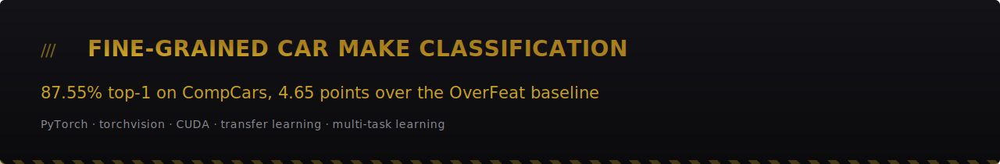
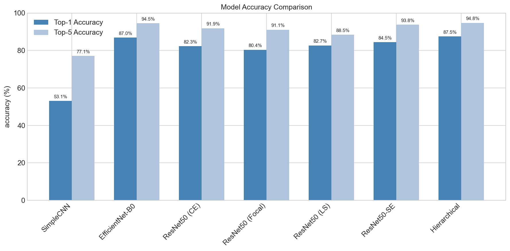
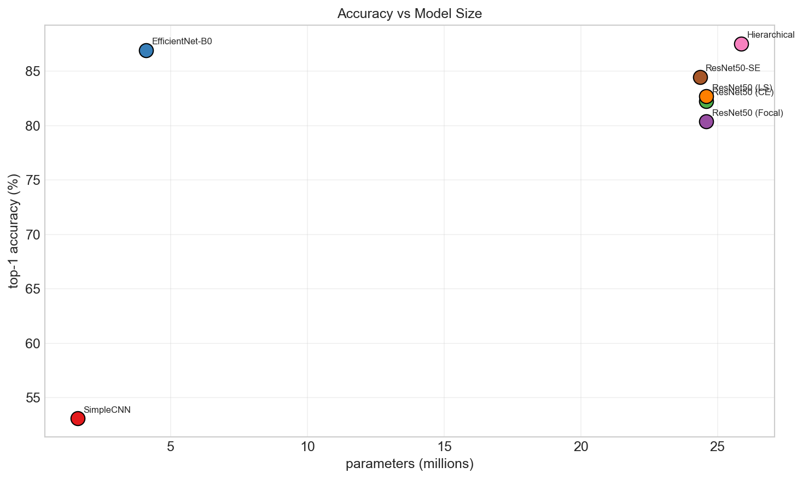
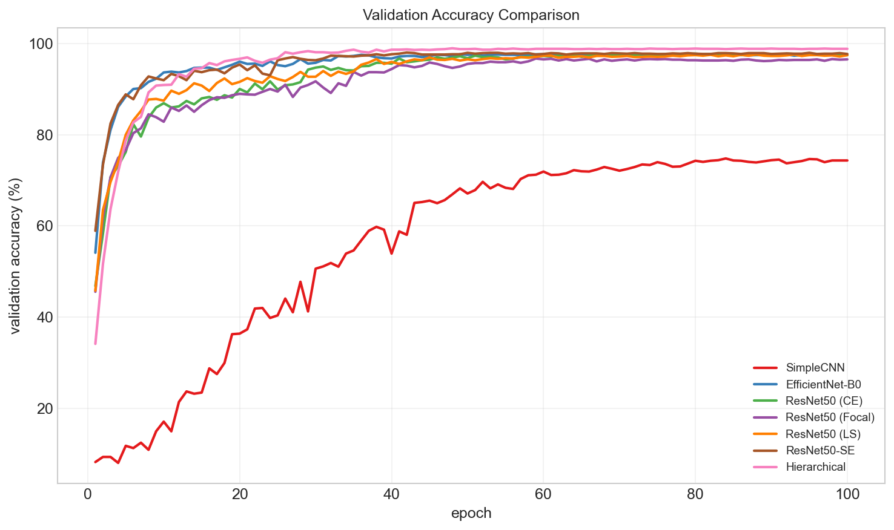

> **A hierarchical dual-head ResNet50 reaches 87.55% top-1 make accuracy on the CompCars test split, 4.65 points above the OverFeat baseline of Yang et al.**

[](https://www.python.org)
[](https://pytorch.org)
[](https://pytorch.org/vision)
[](https://numpy.org)
[](https://pandas.pydata.org)
[](https://scikit-learn.org)
[](https://matplotlib.org)
[](https://seaborn.pydata.org)
[](https://python-pillow.org)
[](https://tqdm.github.io)
[](LICENSE)
[](report/report.pdf)



*Top-1 and top-5 make accuracy on the 14,939-image CompCars test split. The hierarchical model leads at 87.55% top-1.*

## Abstract

Five convolutional architectures were trained on the CompCars classification split (30,955 images, 75 makes, 431 models) and evaluated on the official test split: a from-scratch baseline CNN, ResNet50, EfficientNet-B0, ResNet50 with Squeeze-and-Excitation attention, and a hierarchical multi-task network with two heads on one shared ResNet50 backbone. Seven training runs cover four loss functions across those architectures. The hierarchical network is the best model, at 87.55% top-1 make accuracy and 82.72% top-1 model accuracy on test, against the 82.9% and 76.7% reported by Yang et al. with OverFeat features and multi-view fusion. Its second head costs nothing at inference (420 img/s, against 411 img/s for the same backbone with one head). ImageNet pretraining dominates every other design choice: pretrained backbones land between 80% and 88% test accuracy, the identical recipe from scratch reaches 53.08%.

## Problem

Telling a Skoda from a Volkswagen in a photograph. They share platforms, proportions and styling language, and the difference lives in a grille, a badge and a headlight cluster, all of which have to survive viewpoint, lighting and background clutter.

This is fine-grained visual categorisation: many classes, low inter-class variance, high intra-class variance. CompCars gives 75 makes and 431 models over 30,955 images, split 16,016 train and 14,939 test. Two properties make it harder than the class count suggests. The make labels are imbalanced 120:1, from 1,201 images for the largest class down to 10 for the smallest. And the official test split is not a random slice of the training data, so a model that memorises photo sources scores beautifully on a random validation split and then collapses on test. Every model trained here lost between 10.80 and 21.70 accuracy points across that boundary.

## Motivation

Vehicle make and model recognition is the front end of automated tolling, parking enforcement, traffic analytics, stolen-vehicle detection and insurance claim triage. Each of those runs under a throughput or cost budget, so the useful question is where a model sits on the accuracy-cost front. Inference throughput was measured for all seven runs on the same GPU and the same test set, so the trade is visible rather than assumed.

There is a methodological point that carries past cars. On any benchmark whose test split is drawn from different sources than its training split, a random validation split is a model-selection signal and nothing more. Reporting it as a performance estimate, as is common, overstates results here by 10 to 22 points.

## Approach

Five architectures, one training recipe.

| Model | Backbone | Head | Params |
|---|---|---|---|
| SimpleCNN | 4-block VGG-style, from scratch | dropout + linear | 1.60M |
| ResNet50 | ImageNet-pretrained | 2048 to 512 to 75 | 24.60M |
| EfficientNet-B0 | ImageNet-pretrained | 1280 to 75 | 4.10M |
| ResNet50-SE | ImageNet-pretrained, SE block after each stage (reduction 16) | 2048 to 75 | 24.36M |
| Hierarchical | ImageNet-pretrained ResNet50, shared | 2048 to 512 to 75 (make) and 2048 to 512 to 431 (model) | 25.87M |

Transfer learning is the backbone of four of the five. The SE block recalibrates channel responses after each residual stage, a cheap global-context mechanism that adds 0.7M parameters and 1.79 points over plain ResNet50.

The hierarchical model exploits the annotation hierarchy that CompCars already ships. Both heads read the same 2048-dimensional pooled feature, one predicting the 75 makes and one the 431 models, so the 431-class task acts as an auxiliary supervision signal for the coarse task. From `src/models.py`:

```python
    def forward(self, x):
        # shared feature extraction
        features = self.backbone(x)

        # parallel classification
        make_logits = self.make_head(features)
        model_logits = self.model_head(features)

        return make_logits, model_logits
```

The loss is `L = alpha * L_make + (1 - alpha) * L_model` with alpha = 0.3, putting 70% of the weight on the harder 431-class task. Losses compared across runs: cross-entropy, focal (gamma = 2), and label smoothing (0.1). Optimisation is AdamW with differential learning rates (1e-4 backbone, 1e-3 heads), batch size 32, weight decay 1e-4, gradient clipping at norm 1.0, ReduceLROnPlateau on patience 3, early stopping on patience 5, mixed precision, up to 100 epochs, on one RTX 3060 (12GB).

## Results

Test split, make classification, 75 classes, 14,939 images. Precision, recall and F1 are macro-averaged. Numbers come from [`results/comparison/summary.csv`](results/comparison/summary.csv); the full index of what is in `results/` is in [`results/README.md`](results/README.md).

| Model | Params (M) | Top-1 (%) | Top-5 (%) | Precision | Recall | F1 | Best val (%) | Throughput (img/s) |
|---|---|---|---|---|---|---|---|---|
| SimpleCNN | 1.60 | 53.08 | 77.12 | 0.5721 | 0.4260 | 0.4592 | 74.78 | 1734 |
| EfficientNet-B0 | 4.10 | 86.95 | 94.50 | 0.8974 | 0.8327 | 0.8528 | 97.75 | 844 |
| ResNet50 (CE) | 24.60 | 82.28 | 91.88 | 0.8386 | 0.7687 | 0.7893 | 97.75 | 411 |
| ResNet50 (Focal) | 24.60 | 80.39 | 91.12 | 0.8299 | 0.7419 | 0.7634 | 96.69 | 410 |
| ResNet50 (LS) | 24.60 | 82.69 | 88.47 | 0.7941 | 0.8142 | 0.7699 | 97.57 | 406 |
| ResNet50-SE | 24.36 | 84.48 | 93.78 | 0.9107 | 0.8208 | 0.8532 | 98.00 | 394 |
| **Hierarchical** | 25.87 | **87.55** | **94.77** | 0.9096 | 0.8486 | **0.8702** | 98.94 | 420 |
| OverFeat (Yang et al., 2015) | | 82.90 | | | | | | |

Validation and test are different splits and the difference is large, so both are given. Validation is a 10% stratified slice of the training images, drawn from the same photo sources as training. Test is the official CompCars split. The hierarchical model scores 98.94% make and 95.51% model on validation, and 87.55% make and 82.72% model on test. The validation figure is useful for early stopping and worthless as a performance claim, and an earlier draft of the report conflated the two.

On the fine-grained 431-class task the hierarchical model reaches 82.72% top-1, 91.80% top-5, macro F1 0.8187, against the 76.7% of the OverFeat baseline.



*EfficientNet-B0 sits far to the left of the ResNet family at nearly the same accuracy. That is the deployment story in one plot.*



*Every pretrained model is within a point of its peak by roughly epoch 20. SimpleCNN never gets there.*

## Discussion

**Parameter efficiency beats scale here.** EfficientNet-B0 carries 4.10M parameters, ResNet50 carries 24.60M, and the small model wins by 4.67 points of top-1 while running at 844 img/s against 411 img/s. Plain ResNet50 is on nobody's Pareto front. The two models worth shipping are the hierarchical network when accuracy is the constraint and EfficientNet-B0 when throughput or memory is, at a cost of 0.60 points.

**The auxiliary head is a regulariser and it is free.** Adding the 431-class head lifts *make* accuracy by 4.86 points over the single-task ResNet50 with the same loss, and drops the train-to-validation gap over the last ten epochs from 2.62 to 1.18 points, the lowest of any run. Throughput is unchanged, because both heads are two linear layers over a pooled vector that the backbone already computed. At deployment the fine head can simply be dropped.

**Focal loss did not help.** It lost 1.89 points to plain cross-entropy despite the 120:1 imbalance it was designed for. Class discriminability, not class frequency, is the binding constraint on this dataset.

**Volkswagen is the sink.** In the hierarchical model's ten worst confusion pairs, Volkswagen is the predicted label in seven. 8.8% of Skoda test images are called Volkswagen, and EfficientNet-B0 makes that same error on 15.9% of them. Skoda is a Volkswagen Group marque and Volkswagen is the largest class in the training data, so the prior and the pixels point the same way. Some of the error is unreachable from one image: EfficientNet-B0 calls 66.7% of Brabus images "Benz", and a Brabus is a Mercedes body with a tuner's badge on it.

**The two heads fail together, but only mostly.** Of the images where the model head is wrong, 59.95% also have the make wrong. Of the images where the make head is wrong, the model head still names the exact car 16.77% of the time, which means the fine head carries information the coarse head is throwing away and a consistency constraint between them is unexploited work.

## Limitations

- The CompCars images are not in this repository and cannot be, because CUHK requires a signed release agreement. The trained checkpoints (`.pth`) are not shipped either, being far too large for GitHub.
- The validation-to-test gap is 10.80 to 16.30 points for the pretrained models and 21.70 for SimpleCNN. Early stopping therefore ran on a signal that does not track the quantity anyone cares about. A validation split drawn from held-out photo sources would fix this and was not built.
- Macro recall is where the rare makes hide. 9 of the 75 make classes score below 0.80 F1 on the hierarchical model, and 144 of the 431 model classes do. One make reaches precision 1.00 with recall 0.39, meaning the model is right whenever it commits and it almost never commits.
- Single seed per configuration. No confidence intervals, so a 0.60 point difference between two models should not be over-read.
- No test-time augmentation, no ensembling, no multi-view fusion, all of which the OverFeat baseline used.

## Reproduce

**Dependencies**, as imported by `src/` and the notebooks. Nothing is version-pinned in this repository; the runs were done under Python 3.11.

```
torch
torchvision
numpy
pandas
scikit-learn
matplotlib
seaborn
pillow
tqdm
```

**Data.** CompCars, from the CUHK Multimedia Lab: <https://mmlab.ie.cuhk.edu.hk/datasets/comp_cars/>. Access requires signing their release agreement. The code expects the official split files under `train_test_split/classification/{train,test}.txt` and the images under `dataset/data/`.

**Notebook order.**

1. `notebooks/01_explore_data.ipynb`, dataset statistics and class distributions.
2. `notebooks/02_train.ipynb`, the seven training runs.
3. `notebooks/03_evaluation.ipynb`, test-set metrics, confusion matrices, per-class reports.
4. `notebooks/04_analysis.ipynb`, cross-model comparison, generalisation gaps, confusion structure, inference timing.

Notebooks 1 and 2 need the dataset. Notebook 2 additionally needs a CUDA GPU; the seven-run sweep took roughly eight hours on an RTX 3060 (12GB) and will not finish usefully on CPU. Notebooks 3 and 4 read from the committed `results/` directory, so every comparison table, gap plot and confusion listing in this README regenerates without the dataset and without retraining.

`src/` holds the library code: `models.py`, `losses.py`, `training.py`, `dataset.py`, `evaluate.py`, `visualization.py`, `utils.py`.

## Report, data and citation

The full technical write-up, with architecture diagrams, equations and complete tables, is **[report/report.pdf](report/report.pdf)** (IEEE conference format).

Dataset: CompCars, CUHK Multimedia Lab, <https://mmlab.ie.cuhk.edu.hk/datasets/comp_cars/>.

License: MIT, see [LICENSE](LICENSE). The license covers the code and the results in this repository. It does not cover the CompCars images, which stay under CUHK's terms.

To cite this repository:

```bibtex
@misc{mihailescu_finegrained_cars,
    author = {Alexandru Mihailescu},
    title  = {Fine-Grained Car Make Classification on CompCars},
    howpublished = {\url{https://github.com/artaeun/fine-grained-car-classification}},
    note   = {Hierarchical multi-task CNN, 87.55\% top-1 make accuracy}
}
```

To cite the dataset:

```bibtex
@inproceedings{Yang2015,
    Author = {Linjie Yang and Ping Luo and Chen Change Loy and Xiaoou Tang},
    Title = {{A Large-Scale Car Dataset for Fine-Grained Categorization and Verification}},
    Booktitle = {{IEEE Conference on Computer Vision and Pattern Recognition (CVPR)}},
    Address = {{Boston, MA, USA}},
    Month = jun,
    Year = {2015},
    Pages = {3973--3981}
}
```
